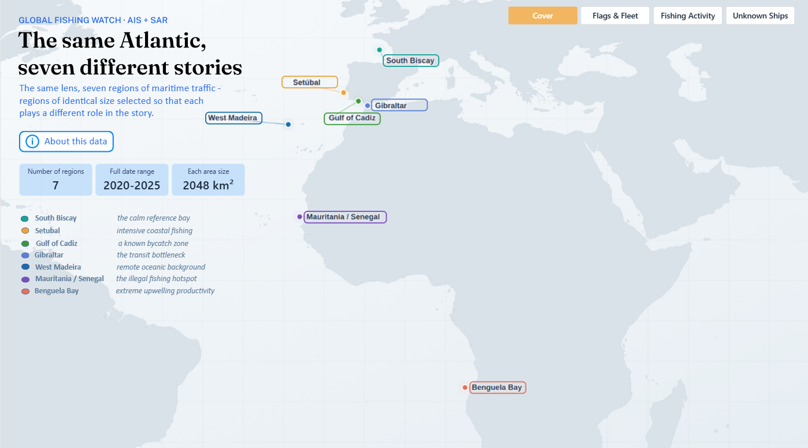
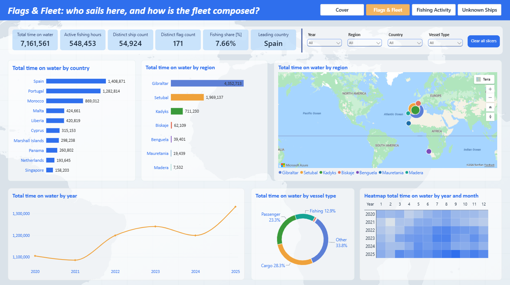
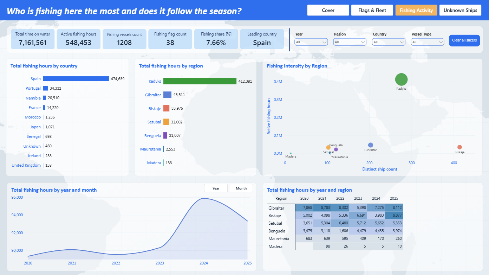
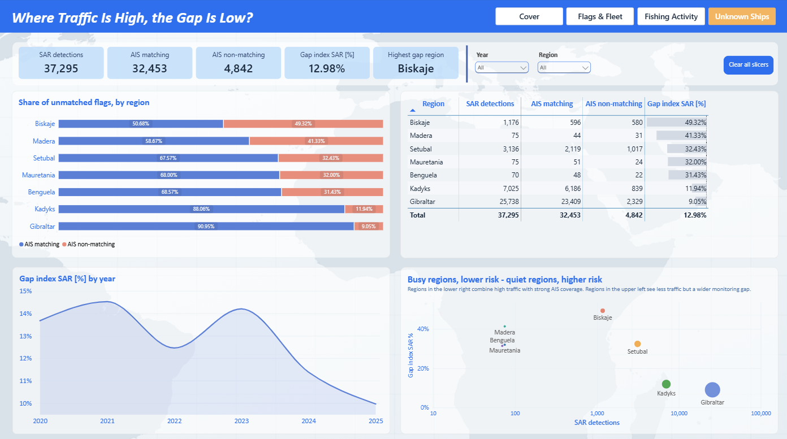

## Dashboard Pages

#1. Cover - The Same Atlantic, Seven Different Stories

An interactive map of 7 Atlantic regions (Strait of Gibraltar, West Madeira, Mauritania/Senegal,
Benguela Bay, Gulf of Cadiz, Setúbal, South Biscay), each color-coded and paired with a hover
tooltip describing its role: the calm refernence bay, intensive coastal fishing, transit 
chokepoint, IUU fishing hotspot, upwelling productivity zone, bycatch area, remote oceanic background. Page sets up the 
question the rest of the report answers: who operates where,
and why these seven areas were chosen for comparison.

🔗 [Open the Live Interactive Dashboard →](https://app.powerbi.com/view?r=eyJrIjoiNmVhMjg4MjYtMDZjOS00MWE3LTk2ZTgtY2ZmYjU5YzlmYWU1IiwidCI6ImJhOWFiZWRlLTZmOWYtNDRlMC05OWU4LTMwYjNmOGI5YzQ2YyJ9)

## Background: What is AIS?

The Automatic Identification System (AIS) is a safety technology required under
the International Maritime Organization's SOLAS Convention (Regulation V/19).
Ships broadcast their identity, position, course, speed, and navigational status
to nearby vessels, shore stations, and satellites, primarily to prevent collisions
and support search and rescue.

AIS carriage is mandatory for:
- All ships of 300 gross tonnage and above on international voyages
- Cargo ships of 500 gross tonnage and above on domestic voyages
- All passenger ships, regardless of size or voyage type

This dashboard compares AIS signals against SAR (satellite radar) detections to
identify vessels that appear on radar but are not broadcasting AIS - either due
to equipment failure, being below the size threshold, or deliberately switching
it off.

### 2. Flags & Fleet - Who Sails These Waters

Breaks down vessel traffic by flag state and vessel type across the seven regions. Shows fleet
composition, top flags by activity, and how vessel-type mix differs region to region.

### 3. Fishing Activity - When and Where Fishing Happens

Tracks fishing activity over time and by region, with a small-multiples view comparing seasonal
patterns across all seven areas side by side.

### 4. Unknown Ships - Where Traffic Is High, the Gap Is Low

Compares SAR (radar) detections against AIS-matched signals per region to surface vessels operating
without a public tracking signal. Includes a region-level gap index (% of SAR detections with no AIS
match), a flag/true-false breakdown of matched vs. unmatched detections, and a scatter chart plotting
traffic volume against gap size to show that busier regions tend to have proportionally lower risk.

##### Notable Insights

- Traffic volume and monitoring gap move in opposite directions: Gibraltar, the busiest
  region with 25,738 SAR detections, has the lowest AIS gap at just 9.05%, while South
  Biscay, with only 1,176 detections, shows the highest gap at 49.32% — nearly 1 in 2
  radar detections there have no matching AIS signal.

- Across all seven regions, 12.98% of SAR detections (4,842 of 37,295) had no matching
  AIS signal, but this risk is unevenly distributed: the three lowest-traffic regions
  (Madera, Mauritania, Benguela) each show a gap above 30%, despite together accounting
  for less than 1% of total detections.
